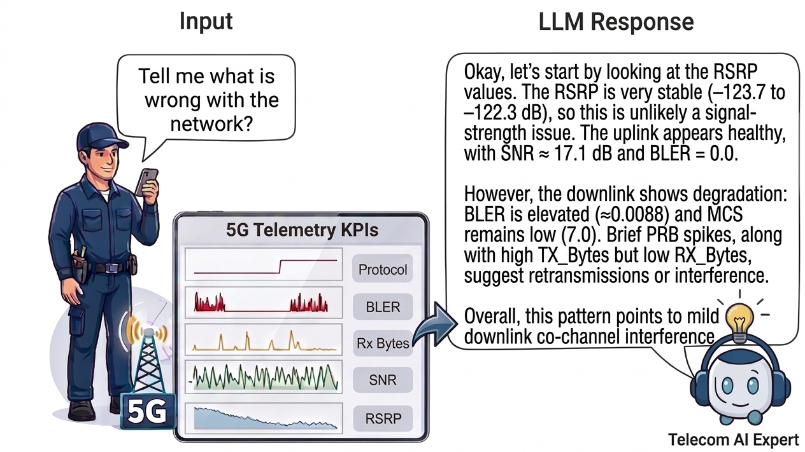

# TelePrism

**A Multi-Modal Foundation Model for Telecom Time Series Reasoning**

<p align="center">
  
</p>

TelePrism lets network operators reason over 5G telemetry in natural language —
detecting anomalies, diagnosing root causes, localizing degraded intervals, and
explaining each conclusion in terms of the underlying KPI evidence. It closes two
gaps that hold back existing time-series + LLM systems:

- **Representation.** Telecom KPI streams have heterogeneous scales, zero
  inflation, strong cross-channel coupling, and non-stationarity — and unlike
  general time series, *absolute magnitude carries meaning* (a persistently low
  RSRP signals a coverage deficit, not a distributional shift). General-purpose
  encoders discard exactly this through instance normalization. TelePrism's
  **TeleEncoder** is designed to preserve absolute scale and cross-channel
  structure.
- **Reasoning.** Prior RL-for-time-series methods convert signals into a
  surrogate modality (serialized text, frozen codebook tokens, or images) before
  training, so reward never shapes the temporal representation itself. TelePrism
  keeps a **dedicated time-series encoder inside the RL loop**, letting verifiable
  rewards directly shape KPI representations and enforce faithful, signal-grounded
  reasoning.

Evaluated on the TelecomTS benchmark (7 network-reasoning tasks: `root_cause`,
`zone`, `anomaly_detection`, `cong` (congestion), `activity`, `motion`,
`anomaly_bounds`), TelePrism reaches state-of-the-art results across all tasks —
ahead of multi-modal baselines by ~6 points on average and a text-serialized
variant by 20+ points.

---

## Contents
- [Overview](#overview)
- [Installation](#installation)
- [Dataset](#dataset)
- [Usage](#usage)
  - [1. Cold-start SFT](#1-cold-start-sft)
  - [2. GRPO reinforcement learning](#2-grpo-reinforcement-learning)
  - [3. Evaluation](#3-evaluation)
  - [4. Inference](#4-inference)
  - [Switching the time-series encoder](#switching-the-time-series-encoder)
- [Repository structure](#repository-structure)
- [Architecture](#architecture)
- [Citation](#citation)
- [License](#license)

---

## Overview

TelePrism contributes three ideas:

**1. TeleEncoder — a telecom-aware, time-series-modulated Mixture-of-Experts
encoder.** Unlike encoders whose routing and experts are static (or conditioned
only on external text), TeleEncoder derives context *from the KPI signal itself*
and uses it to drive computation through two coupled mechanisms:

- **Dual-track Telecom Context Generator.** A *Relational Scale Encoding* track
  places channels as nodes in a learnable graph — node features are log-scale
  statistics (log-mean, log-std, coefficient of variation), edges carry log-ratios
  and correlation — and runs edge-conditioned message passing to emit `C`
  channel-aligned scale tokens that retain absolute magnitude and cross-channel
  relations. A complementary *Channel Behavioral Clustering* track groups channels
  by temporal dynamics into `K` learnable prototypes (Gumbel-sigmoid soft
  assignment + masked cross-attention), capturing higher-order co-behavioral
  structure that the scale track alone cannot.
- **Time Series-Modulated MoE.** This context conditions a **Dynamic Router**,
  which selects experts per patch and channel via cross-attention (a patch
  naturally attends to its own channel's scale token, so the model learns
  channel-specific expert preferences with no explicit supervision), and **CAEM**
  (Context-Adaptive Expert Modulation), which applies an identity-initialized
  affine transform — retrieved by expert-specific cross-attention over the
  context — to each activated expert's output, making modulation content-adaptive.

**2. Early fusion with a language model.** TeleEncoder's full-resolution output is
projected by a single linear alignment layer and prepended to the tokenized
prompt, so Qwen3-4B reasons jointly over KPI tokens and text.

**3. Reinforcement learning that trains the encoder, not just the LLM.** After
cold-start SFT, GRPO optimizes the *entire* pipeline — encoder, alignment layer,
and LM — under a verifiable reward `0.50·task + 0.30·reasoning + 0.20·format`. The
reasoning term matches KPI-evidence patterns in the model's `<think>` trace
against the ground-truth class, rewarding faithful, signal-grounded reasoning and
penalizing label-only shortcuts.

The repository also bundles **8 baseline encoders** — Mantis, TOTO, Chronos (TS
foundation models); Non-Stationary Transformer, Informer, TimesNet, FEDformer,
Autoformer (TS architectures) — each a drop-in replacement for TeleEncoder in the
early-fusion pipeline.

---

## Installation

Requires **Python 3.11+** and one or more **CUDA-capable GPUs**.

> Requires an NVIDIA driver supporting **CUDA ≥ 12.8** (Linux: driver **≥ 570**; check `nvidia-smi`).

```bash
python -m venv .venv && source .venv/bin/activate

# 1. Install the teleprism package (registers the vLLM plugin entry point)
pip install -e .

# 2. Install the dependencies of the vendored verl trainer (src/rl/verl)
pip install -r src/rl/verl/requirements.txt

# 3. Install TelePrism's runtime dependencies (torch, transformers, vllm, deepspeed, …)
pip install -r requirements.txt

# 4. Install the TOTO baseline (git dependency)
pip install "git+https://github.com/varvarigos/toto.git@main#egg=toto-ts"
```

`verl` (the GRPO trainer) is **vendored** under [`src/rl/verl/`](src/rl/verl) and
used directly via `PYTHONPATH` — it is *not* pip-installed. `scripts/run_grpo_training.sh`
adds it to the path automatically.

---

## Dataset

The dataset is [`AliMaatouk/TelecomTS`](https://huggingface.co/datasets/AliMaatouk/TelecomTS)
on HuggingFace and is **auto-downloaded on first run** — no local data setup is
required.

---

## Usage

All training/eval/inference is launched through the scripts in `scripts/`, each
of which reads a YAML config from `configs/`. All checkpoints are written under
`./checkpoints/`. Edit the config or pass CLI flags to change hyperparameters.

### 1. Cold-start SFT

Supervised fine-tuning of TelePrism (TeleEncoder + Qwen3-4B) with DeepSpeed
Zero-3 + LoRA. Trains the time-series encoder, the alignment layer, and the LoRA
adapters jointly.

```bash
bash scripts/train_tsllm.sh
```

- **Config:** `configs/train_tsllm.yaml` (encoder choice via `model_name`, KPI
  list, task list, LoRA, normalization, etc.) and `configs/ds_conf.json`
  (DeepSpeed Zero-3). In `ds_conf.json`, `train_batch_size` must equal
  `num_gpus × train_micro_batch_size_per_gpu × gradient_accumulation_steps`.
- **Output:** SFT checkpoints under `./checkpoints/cold_start/`.

### 2. GRPO reinforcement learning

GRPO on top of the cold-start checkpoint, using the verifiable reward in
`src/rl/training/rewards/reward_telecom.py`. The launcher auto-bakes the SFT
checkpoint into a single HuggingFace model directory, preprocesses the TelecomTS
QA data, and starts training.

```bash
bash scripts/run_grpo_training.sh
# override the config file:
GRPO_CONFIG=configs/grpo_tsllm.yaml bash scripts/run_grpo_training.sh
```

- **Config:** `configs/grpo_tsllm.yaml` (starting checkpoint, LoRA, GPU count,
  GRPO hyperparameters, rollout settings).
- **Reward:** `reward = 0.50·task + 0.30·reasoning + 0.20·format` — task reward
  is exact-match (classification) / IoU (`anomaly_bounds`); reasoning reward does
  per-task positive/negative KPI-pattern matching against the `<think>` trace;
  format reward scores `<think>` structure and penalizes non-Latin script.
- **Output:** GRPO checkpoints under `./checkpoints/grpo/`.

### 3. Evaluation

Multi-task evaluation over the 7 TelecomTS tasks.

```bash
bash scripts/evaluate_tsllm.sh
```

- **Config:** `configs/evaluate_tsllm.yaml` (`eval_tasks` toggles which of the 7
  tasks to run) plus CLI flags in the script (`--checkpoint_dir`, `--tag`,
  `--sample_size`, `--save_predictions`).
- **Output:** per-task metrics; predictions under `./predictions/` when
  `--save_predictions True`.

> The script ships with `--sample_size 5` as a quick smoke test. Remove or raise
> it for a full evaluation run.

### 4. Inference

Single-prompt inference with a trained checkpoint.

```bash
bash scripts/inference_tsllm.sh
```

- Set `--checkpoint_dir` / `--tag` in the script to point at your cold-start or
  GRPO checkpoint.

### Switching the time-series encoder

To run a baseline instead of TeleEncoder, set `model_name` in the relevant YAML
config to one of:

```
teleencoder · toto · mantis · chronos ·
autoformer · fedformer · informer · nonstationary_transformer · timesnet
```

Each encoder is fused with Qwen3-4B through the same alignment layer, so the same
train/eval/inference scripts apply.

---

## Repository structure

```
teleprism/
├── configs/                      # YAML configs + DeepSpeed config
│   ├── train_tsllm.yaml          #   cold-start SFT
│   ├── grpo_tsllm.yaml           #   GRPO RL
│   ├── evaluate_tsllm.yaml       #   evaluation
│   └── ds_conf.json              #   DeepSpeed Zero-3
├── scripts/                      # entrypoint launchers (activate .venv first)
│   ├── train_tsllm.sh
│   ├── run_grpo_training.sh
│   ├── evaluate_tsllm.sh
│   └── inference_tsllm.sh
└── src/                          # the `teleprism` package
    ├── train_tsllm.py            # cold-start SFT
    ├── evaluate_tsllm.py         # multi-task eval
    ├── inference_tsllm.py        # single-prompt inference
    ├── dataset/                  # TelecomTS loading, QA templates, collation
    ├── encoders/                 # TeleEncoder (teleencoder/) + baseline encoders
    ├── models/ts_llm/            # TelePrism model (encoder–LLM fusion) + vLLM plugin
    ├── rl/
    │   ├── training/             # GRPO entrypoint + verifiable rewards
    │   └── verl/                 # vendored verl framework (used via PYTHONPATH)
    ├── evaluation/tasks/         # per-task prompts + parsers
    └── utils/                    # layers, normalization, schedulers
```

---

## Architecture

TelePrism has three components:

1. **TeleEncoder.** Per-channel z-score normalization → patchify → linear
   projection → positional encoding. A **Telecom Context Generator** builds a
   context `Z = [Z_s; Z_p]`:
   - *Relational Scale Encoding* — a GNN over channels using log-mean/log-std
     node statistics and edge features (log-ratios + correlation), producing `C`
     channel-aligned scale tokens `Z_s`.
   - *Channel Behavioral Clustering* — `K` learnable prototype tokens via
     Gumbel-sigmoid cluster assignment + masked cross-attention, producing `K`
     prototype tokens `Z_p`.

   `Z` feeds `L` Transformer blocks, each with patch self-attention and a **Time
   Series-Modulated MoE**: a *Dynamic Router* selects experts via cross-attention
   over `Z`, and **CAEM** modulates each selected expert by an affine transform
   retrieved through expert-specific cross-attention over `Z` (initialized to
   identity). The output `E ∈ R^{B×C×S×d}` preserves channel identity and patch
   detail.
2. **Time Series–Language Alignment.** `E` is flattened to `(B, C·S, d)`,
   projected to the LM hidden dim by a single linear layer, and prepended to the
   tokenized prompt for joint processing by Qwen3-4B.
3. **RL with verifiable rewards.** Cold-start SFT → GRPO with the
   task / reasoning / format reward described above.

---

## Citation

```
\cite{}
```

---

## License

MIT — see [LICENSE](LICENSE).
